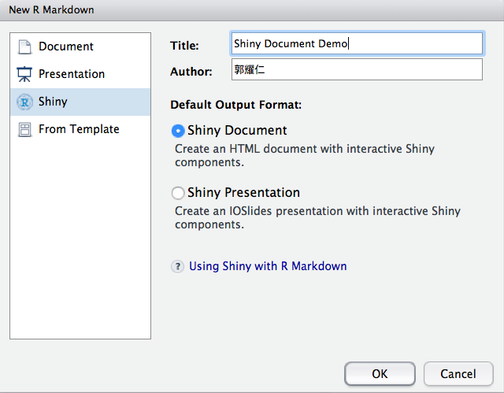
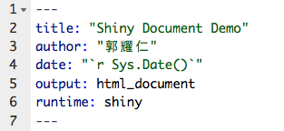

```{r setup, include=FALSE}
knitr::opts_chunk$set(echo = TRUE, results = 'hide', warning = FALSE)
```

## RMarkdown 文件的元素

- 粗體與斜體
- 標題
- 清單
- 程式碼
- 連結
- 圖片
- 調整繪圖函數的輸出
- 更改字型樣式
- 主題
- 引用
- 表格

## 粗體與斜體

```
這是一個**粗體**
這是一個*斜體*
```

這是一個**粗體**
這是一個*斜體*

## 標題

```
# 標題一
## 標題二
### 標題三
#### 標題四
##### 標題五
###### 標題六
```

## 清單

```
資料科學的團隊組成：

- 資料科學家
- 資料分析師
- 資料工程師
```

資料科學的團隊組成：

- 資料科學家
- 資料分析師
- 資料工程師

## 清單（2）

```
資料科學團隊的團隊組成：

- 資料科學家
    - 喜歡數學、統計與演算法
- 資料分析師
    - 喜歡商業智慧、視覺化與報表
- 資料工程師
    - 喜歡系統架構、資料倉儲與自動化
```

資料科學團隊的團隊組成：

- 資料科學家
    - 喜歡數學、統計與演算法
- 資料分析師
    - 喜歡商業智慧、視覺化與報表
- 資料工程師
    - 喜歡系統架構、資料倉儲與自動化

## 程式碼

- echo: (TRUE; logical)
- 是否要將程式顯示在文件中

## 程式碼（2）

- results: ('markup'; character)
    - markup
    - asis
    - hold
    - hide
- 調整 `results` 參數為 `"hide"`，只會輸出程式碼在文件中但不會顯示執行後的結果

## 程式碼（3）

- warning: (TRUE; logical)
- 是否要將程式執行的警告訊息顯示在文件中

```{r}
as.integer("Hello world")
```

## 程式碼（4）

- error: (FALSE; logical)
- 是否允許輸出程式執行錯誤的文件

```
1 + "Hello world"
```

## 程式碼（5）

- message: (TRUE; logical)
- 是否要將程式執行的回傳訊息顯示在文件中

```{r}
library(plotly)
```

## 連結

```
[RMarkdown](http://rmarkdown.rstudio.com/index.html)

<http://rmarkdown.rstudio.com/index.html>
```

[RMarkdown](http://rmarkdown.rstudio.com/index.html)

<http://rmarkdown.rstudio.com/index.html>

## 圖片

```

```


## 圖片（2）

- 調整圖片的大小
- 使用 `knitr` 套件的 `include_graphics()` 函數 `{r out.width="__px", echo = FALSE}`

```
library(knitr)
include_graphics("http://www.clipartbest.com/cliparts/Kij/Lx5/KijLx5kyT.jpg")
```

## 調整繪圖函數的輸出

- 沒有調整：

```{r}
plot(cars)
```

## 調整繪圖函數的輸出（2）

- 利用 fig.height、fig.width 與 fig.align 等參數調整

```{r fig.width = 5, fig.height = 3, fig.align = 'center'}
plot(cars)
```

## 更改字型樣式（補充）

- 新增一個 style.css
- 在 YAML 新增 `css: style.css`

```
#id .class {
  font-family: 指定字型
}
```

## 更改字型樣式（補充）（2）

- [Google Fonts](https://fonts.google.com/)
- 在 .Rmd 的目錄中建立一個 `style.css`
- 以 `Noto Sans` 字型為例貼入：

```
body {
    font-family: 'Noto Sans', sans-serif;
}
```

## 更改字型樣式（補充）（3）

- 更改 YAML 的設定：

```
output:
  html_document:
    css: style.css
```

## 主題

- 不想自己設定，可以用預設的主題（theme）
- [Appearance and Style](http://rmarkdown.rstudio.com/html_document_format.html#appearance_and_style)

```
output:
  html_document:
    theme: united
    highlight: tango
```

## 引用

```
> My mom always said life was like a box of chocolates. You never know what you're gonna get.
> [Forrest Gump](https://en.wikipedia.org/wiki/Forrest_Gump)
```

> My mom always said life was like a box of chocolates. You never know what you're gonna get.
> [Forrest Gump](https://en.wikipedia.org/wiki/Forrest_Gump)

## 表格

```
|喜歡的樂團|Lead Vocal|起源|
|----------|----------|----|
|Beyond|黃家駒|香港|
|The Beatles|John Lennon|英國|
```

|喜歡的樂團|Lead Vocal|起源|
|----------|----------|----|
|Beyond|黃家駒|香港|
|The Beatles|John Lennon|英國|

## 數學方程式

- 利用 `$y = x^2$` 加入行內數學方程式
- 利用 `$$y = x^2$$` 加入數學方程式區塊

## 整合 Shiny

- 為分析報告添加互動性與彈性
- 新增 **Shiny Document**



## 整合 Shiny（2）

- YAML 設定：



## 整合 Shiny（3）

- [整合 Shiny 簡單範例](https://yaojenkuo.shinyapps.io/shiny_doc_demo/)

## 延伸閱讀

- <http://markdown.tw/>
- <http://rmarkdown.rstudio.com/index.html>
- <https://shiny.rstudio.com/>
- <https://en.wikibooks.org/wiki/LaTeX/Mathematics>